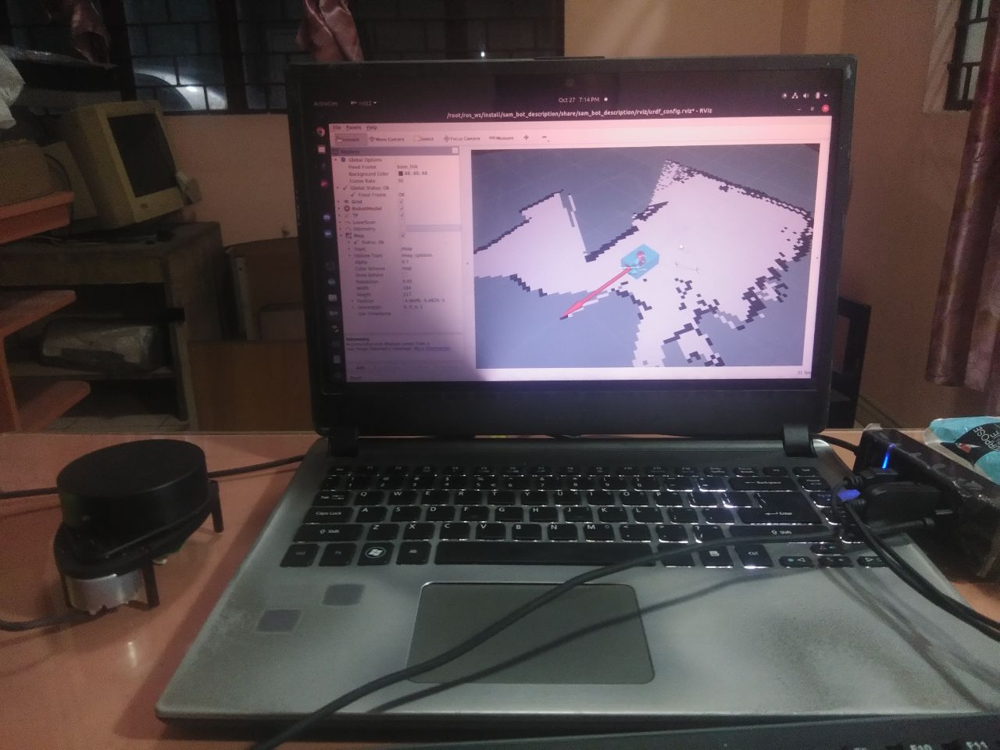

# vegvisir
ᚹᚨᚾᛞᛖᚱᛁᛜ ᛒᚢᛏ ᚾᛟᛏ ᛚᛟᛊᛏ


Make 2D maps from RPLidar and Nav2.

## Tech Used
* ROS2 Galactic
* Nav2
* RPLidar A1

## Demo


## Usage

```
docker run --rm -it --net=host --device /dev/dri/ --device /dev/ttyUSB0 -e DISPLAY=$DISPLAY -v $HOME/.Xauthority:/root/.Xauthority:ro vegvisir:latest
```

## Next steps
* Decouple scanner from nav2 brain to 2 containers